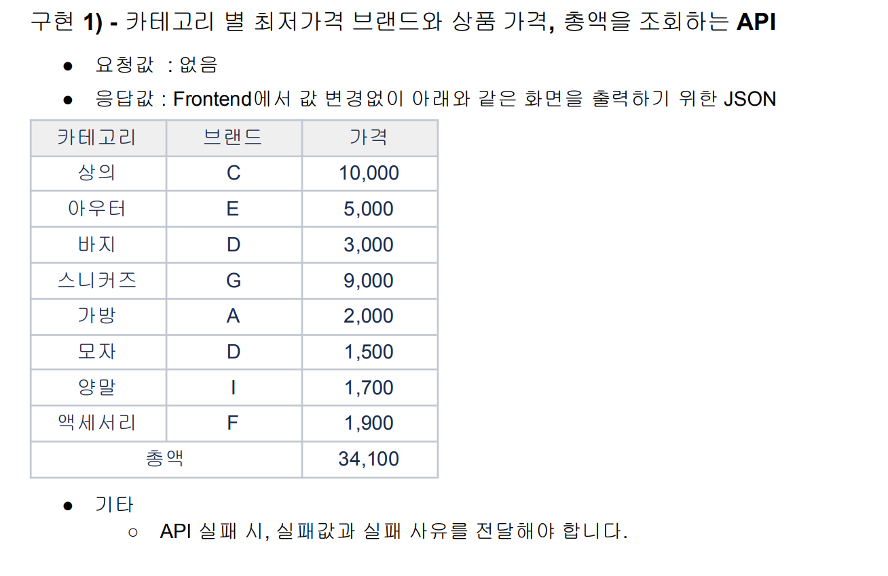
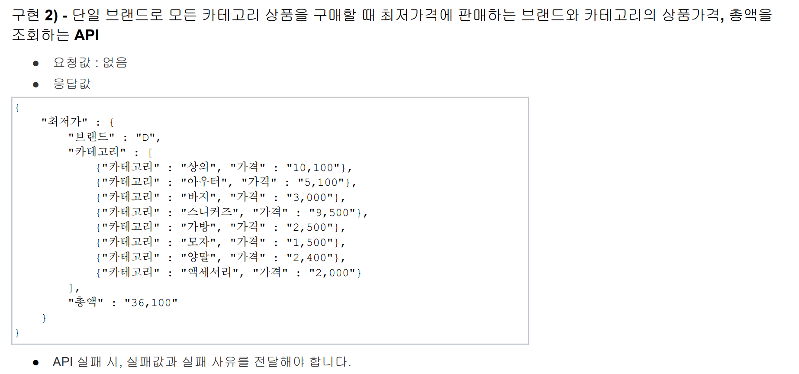
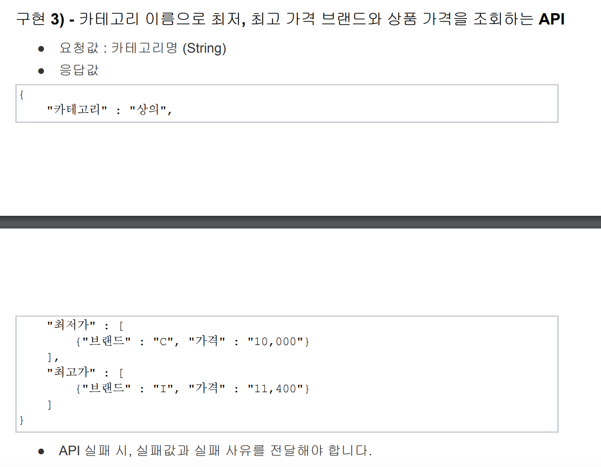
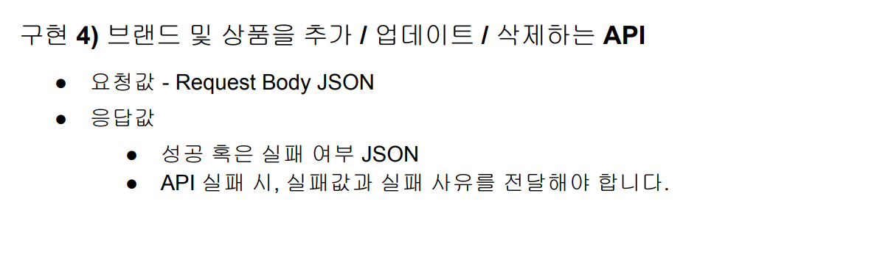

# Musinsa Assignment

Spring Boot 기반의 브랜드 및 상품 카탈로그 관리 서비스입니다.  

---

## ✅ 프로젝트 Spec

- **IDE**: IntelliJ IDEA
- **Framework**: Spring Boot 3.3.0
- **Java**: 17
- **Language**: Kotlin
- **Build Tool**: Gradle 8.1.3
- **Database**: H2 In-Memory DB
- **API Docs**: Swagger UI 제공
- **Test**: JUnit5, MockK

---

## 🔗 주요 URL

- **Swagger UI**: [http://localhost:8080/swagger-ui/index.html](http://localhost:8080/swagger-ui/index.html)
- **H2 Console**: [http://localhost:8080/h2-console/](http://localhost:8080/h2-console/)

---

## 📦 빌드 및 테스트

### 🔧 빌드
```bash
./gradlew clean build
```
### 🧪 테스트
```bash
./gradlew :test
```
- **Test 결과 확인**: [index.html](build/reports/tests/test/index.html)
---
## 📁 프로젝트 구조
```
src/
├── main
│   ├── kotlin
│   │   └── com.sct.musinsa.assignment
│   │       ├── MusinsaAssignmentApplication.kt
│   │       ├── catalog
│   │       │   ├── controller
│   │       │   │   ├── payload (DTO)
│   │       │   │   └── v1 (REST API)
│   │       │   ├── persistence
│   │       │   │   ├── domain (도메인 로직 및 코드/엔티티)
│   │       │   │   └── repository (JPA, QueryDSL)
│   │       │   └── service (Service Layer)
│   │       └── common
│   │           ├── config (설정)
│   │           ├── http (예외 및 응답 핸들링)
│   │           ├── persistence.entity.audit (감사 정보)
│   │           └── util (유틸리티)
│   └── resources
│       ├── application.yml
│       ├── application-h2.yml
│       ├── application-local.yml
│       ├── application-prod.yml
│       └── io/all-brand-product-info.json
└── test
├── kotlin
│   └── com.sct.musinsa.assignment
│       ├── catalog.persistence.domain (도메인 단위 테스트)
│       └── catalog.service (서비스 유닛/통합 테스트)
└── resources
└── io/all-brand-product-info.json
```
### 패키지 구조
본 프로젝트는 Layered Architecture를 기반으로 도메인 기능을 구성하였으며,
Service Layer와 Domain Layer 분리를 위해 각 계층은 의존하지 않고 독립적으로 설계 되었음.

비즈니스 요구사항에 따른 처리는 Service 객체에서 담당하고, 도메인 자체의 핵심 로직은 Aggregate 객체에서 수행하도록 역할을 분리 하였음.

계층 간 의존관계는 Controller → Service  → Persistence 방향으로 제한 하되 ,레이어 간의 Visibility는 
요구사항 구현의 구체성에 따라 의존 관계의 역순 으로 구성 하였음.
또한 계층간 요구사항은 DTO를 통해 명세화 하여, 의존성 역전 원칙을 준수 하였음.

JPA Entity는 Domain Layer에 위치하며, 복잡한 정보성 조회(예: Join 쿼리 등)는 QueryDSL을 통해 구현함.
또한 영속성 관련 처리는 Persistence Layer의 Repositor로 역할을 분리 하였음.

- **com.sct.musinsa.assignment**: 프로젝트 루트
- **catalog**: 브랜드 및 상품 카탈로그 관리
  - **controller**: REST API 컨트롤러
    - **payload**: Presentation Layer DTO
    - **v1**: REST API
  - **persistence**: JPA, QueryDSL
    - **domain**: 도메인 로직 및 코드/엔티티
      - **code**: Domain Code
      - **entity**: Domain Entity
    - **repository**: JPA, QueryDSL
  - **service**: Service Layer
- **common**: 공통
  - **config**: 설정
  - **http**: 예외 및 응답 핸들링
  - **persistence.entity.audit**: 감사 정보
  - **util**: 유틸리티
### 네이밍 컨벤션
- **패키지**: 소문자, 단어 구분은 `_` 사용
- **클래스**: UpperCamelCase
- **메소드 & 변수**: lowerCamelCase
- **상수**: UPPER_SNAKE_CASE
### 역할별 네이밍 컨벤션
- **Presentation DTO**: `Request`, `Response` 접미사 사용
- **Service**: `Service` 접미사 사용
- **Repository**: `Repository` 접미사 사용
- **Entity**: `Entity` 접미사 사용
- **Aggregate**: `Aggregate` 접미사 사용
- **Value Object**: `VO` 접미사 사용
- **QueryDSL**: `Dsl` 접미사 사용
- **Exception**: `Exception` 접미사 사용
- **Configuration**: `Configuration` 접미사 사용

---
## ERD
Catalog ERD brand 관리 및 상품 관리를 위한 ERD

---
## 📝 API 명세
### API 응답 구조 및 응답 코드
[Response.kt](src/main/kotlin/com/sct/musinsa/assignment/common/http/response/Response.kt)

성공 응답(HTTP Status: 200)
```
{
  "code": "code.ok.200",
  "message": "성공",
  "data": {...}
}
```

Client 오류 응답(HTTP Status: 400)
```
{
  "code": "validation.bad-request.400",
  "message": "요청 정보를 확인 하세요."
}
```
Server 오류 응답(HTTP Status: 500)
```
{
  "code": "error.internal.500",
  "message": "No value present"
}
```

### Admin API(/v1/admin/**)
[AdminCatalogApiController.kt](src/main/kotlin/com/sct/musinsa/assignment/catalog/controller/v1/AdminCatalogApiController.kt)
- **[과제 #4] 카탈로그 관리**
  - 카탈로그(브랜드 + 상품) 등록/수정: [post] /v1/admin/catalog
  - 카탈로그(브랜드 삭제): [delete] /v1/admin/catalog/brand/{brandId}
  - 카탈로그(상품 삭제): [delete] /v1/admin/catalog/product/{productId}
### FO 기능 API
[CatalogApiController.kt](src/main/kotlin/com/sct/musinsa/assignment/catalog/controller/v1/CatalogApiController.kt)
  - [과제 #1] 카테고리 별 최저가격 조회: [get] /v1/catalogs/categories/best-price
  - [과제 #2] 최저가격에 판매하는 브랜드-카테고리별 상품 조회: [get] /v1/catalogs/brands/best-price
  - [과제 #3] 카테고리 이름으로 최저, 최고 가격 브랜드와 상품 조회: [get] /v1/catalogs/categories/{productCategory}"
### API 상세 Spec.
**API Docs**: Swagger UI 참고
**Swagger UI**: [http://localhost:8080/swagger-ui/index.html](http://localhost:8080/swagger-ui/index.html)
---
## 📝 과제 검증 방법
- **구현 기능 1번**
  - 
  - 서비스 통합 테스트: [CatalogServiceIntgTest.kt](src/test/kotlin/com/sct/musinsa/assignment/catalog/service/CatalogServiceIntgTest.kt)
    - [1.통합 테스트]카테고리 별 최저가격 브랜드와 상품 가격, 총액을 조회
  - 서비스 유닛 테스트: [CatalogServiceUnitTest.kt](src/test/kotlin/com/sct/musinsa/assignment/catalog/service/CatalogServiceUnitTest.kt)
    - [1.유닛 테스트]카테고리 별 최저가격 브랜드와 상품 가격, 총액을 조회
- **구현 기능 2번**
  - 
  - 서비스 유닛 테스트: [CatalogServiceUnitTest.kt](src/test/kotlin/com/sct/musinsa/assignment/catalog/service/CatalogServiceUnitTest.kt)
    - [2통합 테스트]단일 브랜드로 모든 카테고리 상품을 구매할 때 최저가격에 판매하는 브랜드와 카테고리의 상품가격, 총액을 조회
- **구현 기능 3번**
  - 
  - 서비스 통합 테스트: [CatalogServiceIntgTest.kt](src/test/kotlin/com/sct/musinsa/assignment/catalog/service/CatalogServiceIntgTest.kt)
    - [3통합 테스트]카테고리 이름으로 최저, 최고 가격 브랜드와 상품 가격을 조회
- **구현 기능 4번**
  - 
  - 도메인 유닛 테스트:[CatalogAggregateUnitTest.kt](src/test/kotlin/com/sct/musinsa/assignment/catalog/persistence/domain/CatalogAggregateUnitTest.kt)
    - [유닛 테스트] 신규 A 브랜드/상품 등록,수정,삭제 

